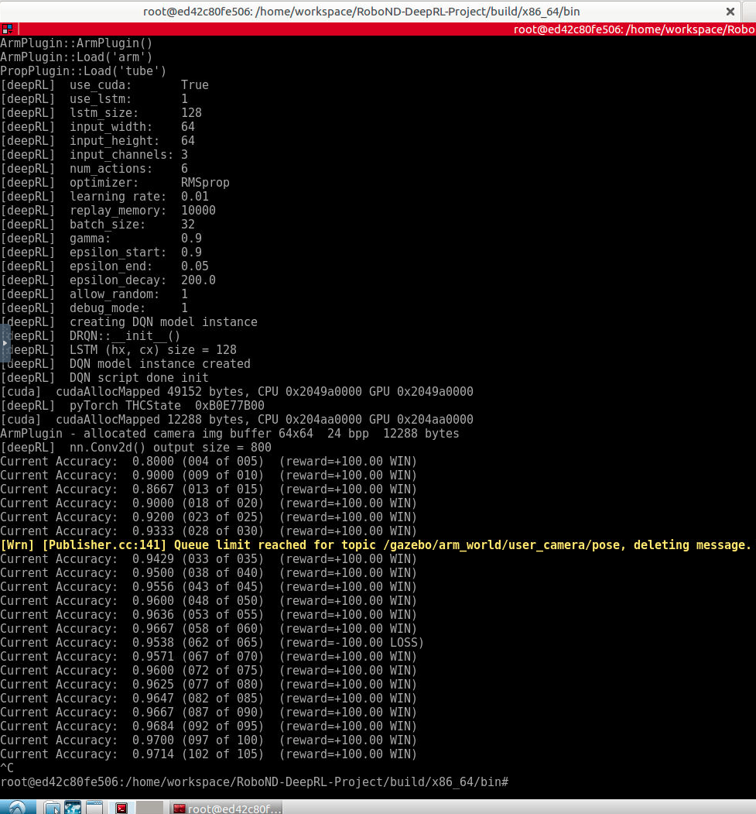
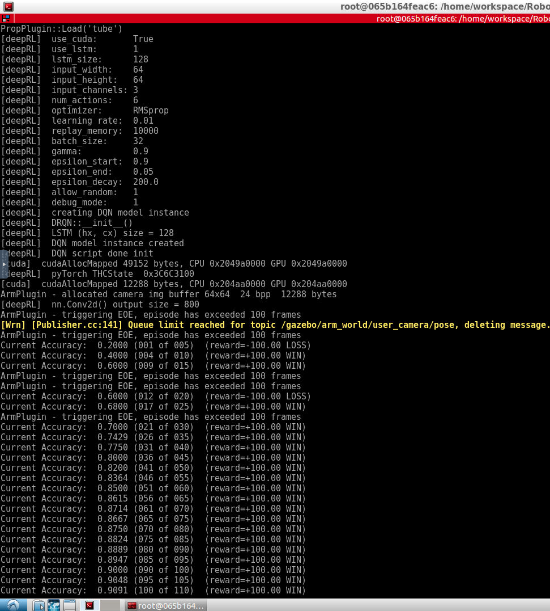

# Deep RL Arm Manipulation 
Project base on https://github.com/udacity/RoboND-DeepRL-Project

### 1.Subscribe to camera and collision topics

ROS topics subscribe code: `gazebo::transport::SubscriberPtr sub = node->Subscribe("topic_name", callback_function, class_instance)`

	
``` C 
// Create our node for camera communication
cameraNode->Init();
cameraSub = cameraNode->Subscribe("/gazebo/arm_world/camera/link/camera/image", &ArmPlugin::onCameraMsg, this);

// Create our node for collision detection
collisionNode->Init();
collisionSub = collisionNode->Subscribe("/gazebo/arm_world/tube/tube_link/my_contact", &ArmPlugin::onCollisionMsg, this);
```

###  2.Create the DQN Agent.

All parameters define on the top of the `ArmPlugin.cpp` 

and add `#define NUM_ACTIONS	DOF*2` as numActions

DQN agent's performance in the project:
- 1. In task 1, the agent is very fast get a good auc but  result is unstable at 25 runs
- 2. In task 2, the agent get low auc at first, but improve to high auc when 35 runs. 
- 

``` c
// Create(uint32_t width, uint32_t height, uint32_t channels, uint32_t numActions,
// 				  const char* optimizer, float learning_rate, uint32_t replay_mem, uint32_t batch_size,
// 				  float gamma, float epsilon_start,  float epsilon_end,  float epsilon_decay,
					  // bool use_lstm, int lstm_size, bool allow_random, bool debug_mode)

agent = dqnAgent::Create(INPUT_WIDTH, INPUT_HEIGHT, INPUT_CHANNELS, NUM_ACTIONS,
									OPTIMIZER, LEARNING_RATE, REPLAY_MEMORY, BATCH_SIZE,
									GAMMA, EPS_START, EPS_END, EPS_DECAY,
									USE_LSTM, LSTM_SIZE, ALLOW_RANDOM, DEBUG_DQN);
```

### 3.Define a velocity or position based control of the arm joints. 

Increase or decrease the joint position based on whether the action is even or odd
Set joint position based on whether action is even or odd.

``` c
float joint; 
if(action%2 == 0 ){
	joint = ref[action/2] + actionVelDelta;
} else {
	joint = ref[action/2] - actionVelDelta;
}
	// limit the joint to the specified range
if( joint < JOINT_MIN )
	joint = JOINT_MIN;
if( joint > JOINT_MAX )
	joint = JOINT_MAX;
ref[action/2] = joint;
```

### 4.Assign reward for the robot gripper hitting the ground. 

compare gripBBox->z and the `groundContact`

In the task 1 , default setting `groundContact = 0.05f` run well.

But in the task 2 it contact ground and failed too many times. So I set `groundContact = 0.01f` to check and assign reward.

``` c
// get the bounding box for the prop object
const math::Box& propBBox = prop->model->GetBoundingBox();
physics::LinkPtr gripper  = model->GetLink(GRIP_NAME);

if( !gripper )
{
	printf("ArmPlugin - failed to find Gripper '%s'\n", GRIP_NAME);
	return;
}

// get the bounding box for the gripper
const math::Box& gripBBox = gripper->GetBoundingBox();
const float groundContact = 0.01f;


bool checkGroundContact = (gripBBox.min.z <= groundContact || gripBBox.max.z <= groundContact);
if( checkGroundContact )
{

	if(DEBUG){printf("GROUND CONTACT, EOE\n");}

	rewardHistory = REWARD_LOSS;
	newReward     = true;
	endEpisode    = true;
}

```

### 5.Issue an interim reward based on the distance to the object and  a reward based on collision between the arm’s gripper base and the object. 

The reward is based on the distance to the object and the collision between the arm’s gripper base and the object.

One recommended reward is a smoothed moving average of the delta of the distance to the goal. It can be calculated as `avgGoalDelta  = (average_delta * alpha) + (dist * (1 - alpha))`

Assign differnet reward base on the value `avgGoalDelta` and `distGoal` 

``` c
if(!checkGroundContact)
{
	const float distGoal = BoxDistance(propBBox, gripBBox); // compute the reward from distance to the goal

	if(DEBUG){printf("distance('%s', '%s') = %f\n", gripper->GetName().c_str(), prop->model->GetName().c_str(), distGoal);}


	if( episodeFrames > 1 )
	{
		const float distDelta  = lastGoalDistance - distGoal;
		avgGoalDelta  = (avgGoalDelta * ALPHA) + (distDelta * (1.0f - ALPHA));
		if(avgGoalDelta >0.01f) {
			rewardHistory = avgGoalDelta * REWARD_WIN;
		} else {
			rewardHistory = REWARD_LOSS * distGoal * 0.1;
		}

		if(distGoal < 0.0001f) {
			rewardHistory = REWARD_WIN*0.8;
		}

		newReward     = true;

		if(DEBUG){printf("(avgGoalDelta,rewardHistory) = ('%f', '%f') \n", avgGoalDelta,rewardHistory);}
	}

	lastGoalDistance = distGoal;
}

```	

### 6.Issue a reward based on collision between the arm and the object. 

In task 1 ,the reward based on between the arm and the object:

``` c
#define COLLISION_ITEM   "tube::tube_link::tube_collision"

bool collisionCheck;
if(	strcmp(contacts->contact(i).collision2().c_str(), COLLISION_POINT) == 0 ) {
	collisionCheck = true;
}

if (collisionCheck)
{
	rewardHistory =  REWARD_WIN;

	newReward  = true;
	endEpisode = true;

	return;
}
```

In task 2 ,the reward based on between the arm and the object:

``` c
#define COLLISION_POINT  "arm::gripperbase::gripper_link"
#define COLLISION_ITEM   "tube::tube_link::tube_collision"

bool collisionCheck;
if(	strcmp(contacts->contact(i).collision1().c_str(), COLLISION_ITEM  ) == 0 &&
	strcmp(contacts->contact(i).collision2().c_str(), COLLISION_POINT) == 0 ) {
	collisionCheck = true;
}

if (collisionCheck)
{
	rewardHistory =  REWARD_WIN;

	newReward  = true;
	endEpisode = true;

	return;
}
```


### 7.Tune the hyperparameters
In task 1 and 2 I tune both of them and use the same hypeparameters.
- `64*64` as the input size is enough to the DQN.
- `OPTIMIZER` I try `RMSprop` and `Adom` and `RWSprop` is better
- `BATCH_SIZE` I think bigger is better , but more than 32 can run well in the class workspasce enviroment.
- `LEARNING_RATE` as 0.01 think is ok when I get the task auc result.
- `REWARD_WIN` change from `0.0f` to `100.0f` I think is easy to see the difference when I debug and tune the parameters.
 
``` c
/*
 Tune the following hyperparameters
*/

#define INPUT_WIDTH   64
#define INPUT_HEIGHT  64
#define NUM_ACTIONS	DOF*2
#define OPTIMIZER "RMSprop"
#define LEARNING_RATE 0.01f
#define REPLAY_MEMORY 10000
#define BATCH_SIZE 32
#define USE_LSTM true
#define LSTM_SIZE 128
#define ALPHA 	0.4f
#define REWARD_WIN  100.0f
#define REWARD_LOSS -100.0f

```


`VELOCITY_CONTROL` I try true and false, and I find that in task 2 position based control of the arm joints is better than velocity.

``` c
#define JOINT_MIN	-0.75f
#define JOINT_MAX	 2.0f

// Turn on velocity based control
#define VELOCITY_CONTROL false
#define VELOCITY_MIN -0.2f
#define VELOCITY_MAX  0.2f
```
As we covered in the previous section, there are two primary objectives to the project 
- 1.Any part of the robot arm should touch the object with atleast an accuracy of 90%.
- 2.Only the gripper base of the robot arm should touch the object with at least an accuracy of 80%.

I get 97,14% accuracy for 105  runs in task 1,
and get 90.91% accuracy for 110  runs in task 2.


### 8.Take a screenshot of the terminal depicting the accuracy from the previous task, or record a video depicting the terminal and the robot in action. 


screenshot for task 1:



screenshot for task 2:


### 9. Future Work
In the project, there are DQN parameters define:

``` c
#define ALLOW_RANDOM true
#define DEBUG_DQN true
#define GAMMA 0.9f
#define EPS_START 0.9f
#define EPS_END 0.05f
#define EPS_DECAY 200
```

I think eps-decay and eps-start-end is not the the best value currently and it could improve the current results.

And In the project,  the object of interest was placed at the same location, if the object  will instantiate at different locations along the x-axis the model will be robust。


